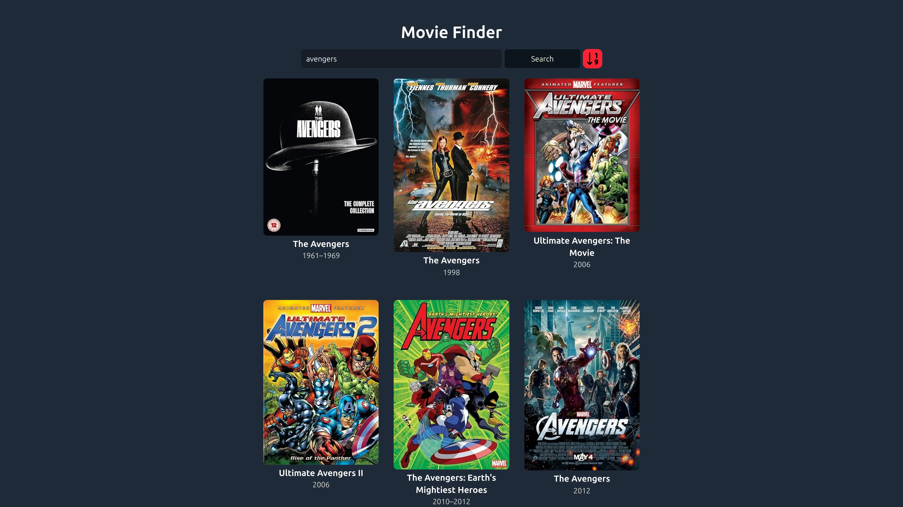
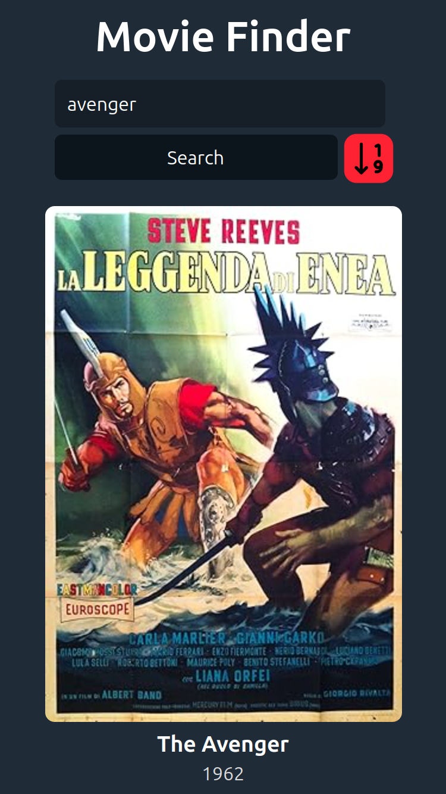

<a id="top"></a>

<h1 align="center"> Movie Finder</h1>

<div align="center">
    <a href="#-about" target="_blank">
        About
    </a>
    <span>&nbsp;✦&nbsp;</span>
    <a href="#-about" target="_blank">
      Deployed Website
    </a>
    <span>&nbsp;✦&nbsp;</span> 
    <a href="#-preview" target="_blank">
        Preview
    </a>
    <span>&nbsp;✦&nbsp;</span>
    <a href="#-features" target="_blank">
        Features
    </a>
    <span>&nbsp;✦&nbsp;</span>
    
</div>
<br>


## 📜 About 
Welcome to my movie search engine! With this tool, you can explore and search for your favorite films. 

Filter by release year and discover new cinematic gems. 

Enjoy the magic of cinema! 🎥🍿

<p align="right">(<a href="#top" >Go Back To Top 🔝</a>)</p>

##  Deployed Website
This project is deployed on vercel
Link: https://movie-finder-jet-eta.vercel.app/
## 👀 Preview
<h4>In a PC (1920x1080)</h4>


<h4>In a iPhone SE (375x667)</h4>


<p align="right">(<a href="#top">Go Back To Top 🔝</a>)</p>


## 💬 Features
- **Favicon Support**: Support for a wide range of favicon sizes has been added, ensuring that the site’s icon displays correctly on all devices and platforms.
- **Open Graph and Twitter Tags**: Open Graph and Twitter meta tags have been included, which optimize the preview of the website on social platforms like Facebook and Twitter.
- **Cross-Browser Compatibility**: The web page uses the `X-UA-Compatible` meta tag, which helps ensure compatibility with multiple browsers, especially older versions of Internet Explorer.
- **Movie API (OMDb)**: I used the OMDb (Open Movie Database) API to retrieve movie information.
- **Grid Responsive**: In this application, the movies will be displayed in rows and columns, adjusting to look good on both large screens and mobile devices.
- **Avoiding Duplicate Searches**: I've implemented logic to prevent the same search from being performed twice in a row. This improves efficiency and the user experience.
- **Automatic Search While Typing**: When the user types in the search field, the application automatically performs a search against the OMDb API without requiring an additional button click. This provides a quicker and smoother response for the user.
- **Avoiding Continuous Searches While Typing (Debounce)**: Debounce is a technique that delays the execution of a function (in this case, the search) until the user has stopped typing for a brief period (300 ms). This prevents continuous searches while the user is still typing, which could overload the API or impact application performance.
  
<p align="right">(<a href="#top">Go Back To Top 🔝</a>)</p>


 Install the dependencies: 

- I used [**bun**](https://bun.sh) to install and manage the dependencies.
  
```bash
# Install bun for MacOS, WSL & Linux:
curl -fsSL https://bun.sh/install | bash

# Install bun for Windows:
powershell -c "iwr bun.sh/install.ps1|iex"

# Install with bun:
bun install
```

- or you can use [**pnpm**](https://pnpm.io):

```bash
# Install pnpm globally if you don't have it:
npm install -g pnpm

# Install dependencies:
pnpm install
```

1. Run the development server:

```bash
# Run with bun:
bun run dev

# Run with pnpm:
pnpm run dev
```

<p align="right">(<a href="#top">Go Back To Top 🔝</a>)</p>


